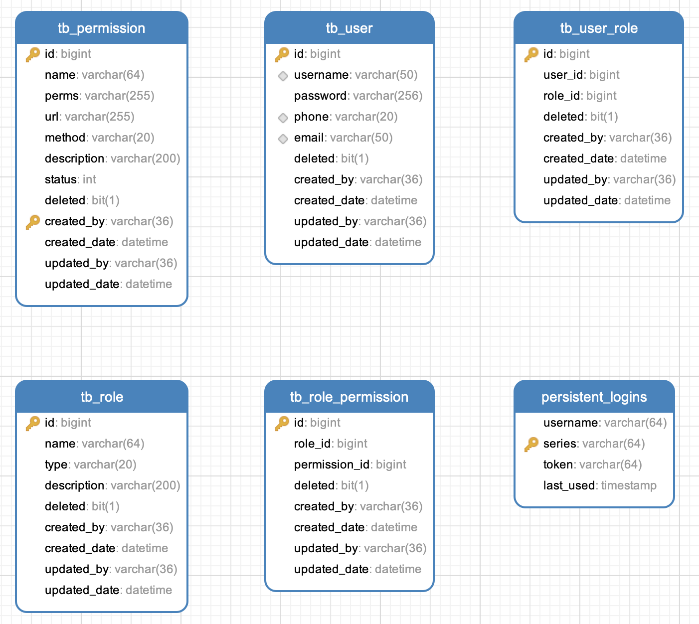
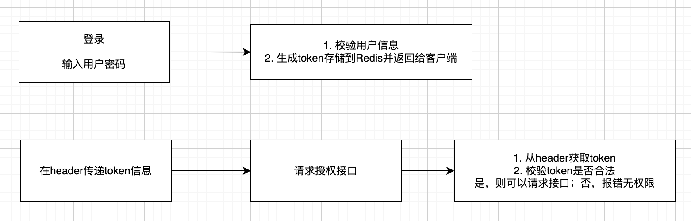
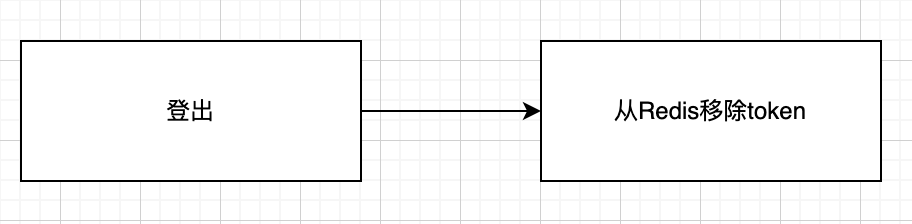
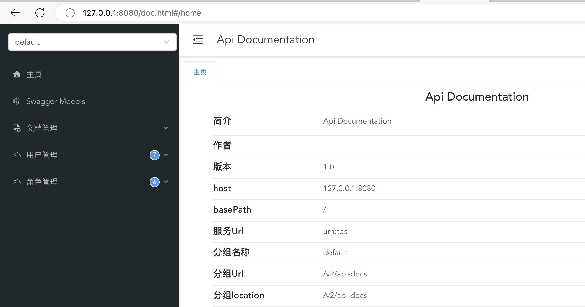
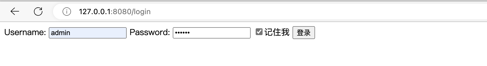
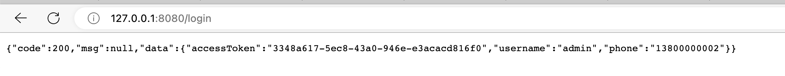
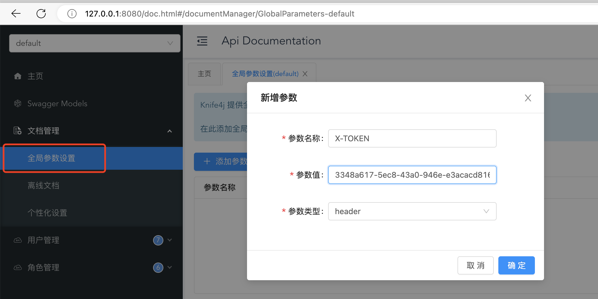
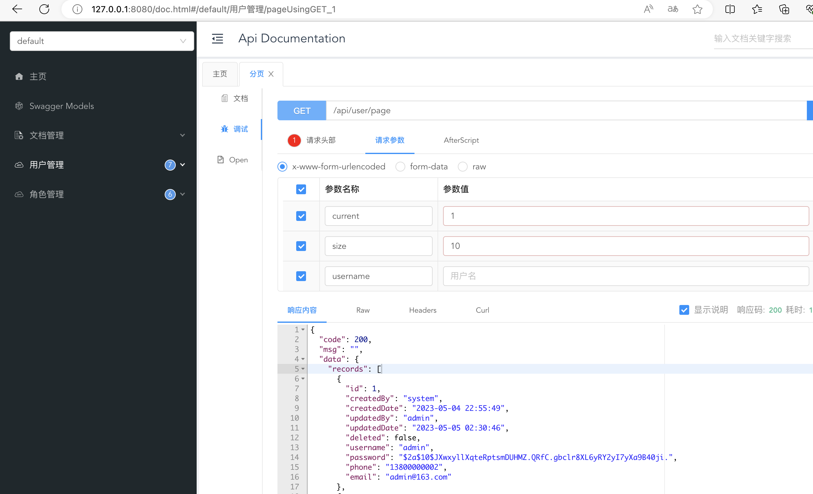
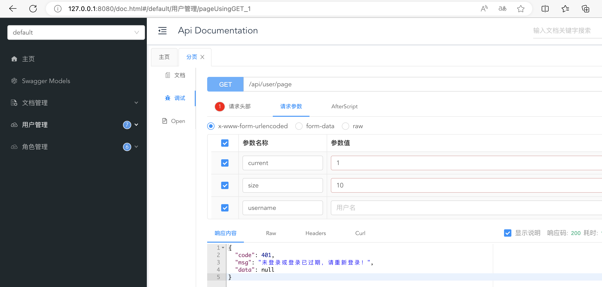
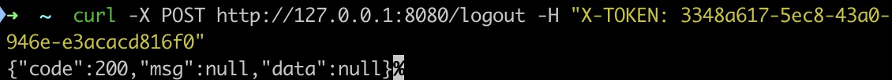

## 技术栈

- Spring Boot
- Spring Security
- MyBatis Plus
- Redis
- MySQL
- Thymeleaf
- Swagger
- Mapstruct
- Lombok
- Java8

## RBAC表设计




- tb_persmission: 权限表
- tb_role_permission: 角色权限表
- tb_role: 角色表
- tb_user_role: 用户角色表
- tb_user: 用户表
- persistent_login: 登录（记住我）功能使用，用于存储token信息

## 系统功能

- 登录、登出
- 用户增删改查、角色分配
- 角色增删改查、权限分配

## 登录





## 登出





## Docker部署

1. 编写Dockerfile

```shell
FROM openjdk:8
ADD target/*.jar app.jar
RUN echo "Asia/Shanghai" > /etc/timezone
ENV JAVA_OPTS="-Xms512m -Xmx512m"
ENTRYPOINT ["/bin/sh", "-c","java -jar ${JAVA_OPTS} app.jar"]

```

1. 打jar包

```shell
 mvn clean package -DskipTests
```

2. 构建镜像

```shell
docker build --rm -t spring-security-jdbc-sample:1.0 .
```

3. 运行容器

```shell
docker run --name=sample \
--restart=always \
-p 8080:8080 \
-d spring-security-jdbc-sample:1.0
```

4. 访问swagger文档 http://127.0.0.1:8080/doc.html#/home




我们也可以借助IDEA Docker插件进行docker部署，这里不再赘述。

## 接口测试

### 登录

1. 输入用户名和密码，并记住我。这里使用超级管理员的账号进行登录,用户名：admin 密码：123456



2. 登录成功，返回token信息。注意这里因为配置了登录成功后的处理器，所以是直接返回请求的响应信息，并没有返回登录成功后的 index.html页面



### 请求权限接口

1. 打开swagger文档  http://127.0.0.1:8080/doc.html#/home ，在头部配置上面返回的token信息



2. 我们想要访问用户列表



3. 未在头部配置token返回的错误信息



### 登出

执行登出操作，输入 curl -X POST http://127.0.0.1:8080/logout -H "X-TOKEN: tokenValue"



### 项目Github地址

https://github.com/lenkax/spring-security-jdbc-sample  欢迎提建议~

### 关注公众号，获得更多技术资讯

